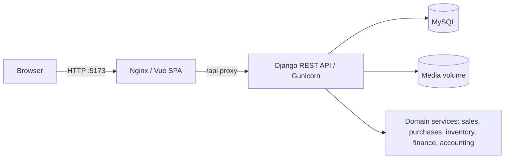

# Financial Accounting Web System

[](https://github.com/robert-viquez/financial-accounting-web-system/actions/workflows/ci.yml)

A full-stack financial and accounting management system built for Queso Los Santos S.A. as a university graduation project. It demonstrates transactional business workflows, REST API design, automated testing, reproducible demo data, containerization, and continuous integration.

> **Status:** Active development. The project is suitable for local demonstration and portfolio review; it has not been presented as a production deployment.

## Problem and use case

Small businesses often manage sales, purchases, stock, receivables, payables, and accounting records across disconnected tools. This application brings those workflows together so operational transactions produce consistent inventory and double-entry accounting effects.

## Features

- JWT authentication, roles, permissions, and audit records
- Customer and supplier management
- Product, category, barcode, and inventory movement management
- Cash and credit sales with stock validation and reversal
- Purchase registration with inventory updates and reversal
- Accounts receivable/payable and payment application
- Double-entry journal entries, accounting periods, and financial reports
- XLSX and PDF report exports
- OpenAPI schema and interactive Swagger documentation
- Deterministic, validated demo-data command

## Technology stack

| Layer | Technology |
| --- | --- |
| Frontend | Vue 3, Vite, Vuetify, Pinia, Axios |
| Backend | Python, Django, Django REST Framework |
| Authentication/API | Simple JWT, drf-spectacular, django-filter |
| Database | MySQL 8.4; SQLite is used by default for isolated tests |
| Delivery | Docker Compose, Nginx, Gunicorn, GitHub Actions |

## Architecture



The Vue single-page application consumes a JWT-protected REST API. Django domain services coordinate database transactions so sales and purchases update inventory, financial accounts, and accounting entries consistently. In Docker, Nginx serves the compiled frontend and proxies `/api/` to Gunicorn.

## Repository structure

```text
.
├── backend/                 # Django project and domain applications
│   ├── config/              # Settings, URL routing, health endpoint
│   ├── usuarios/            # Authentication, roles, configuration, audit
│   ├── terceros/            # Customers and suppliers
│   ├── inventario/          # Products and stock movements
│   ├── ventas/              # Sales
│   ├── compras/             # Purchases
│   ├── finanzas/            # Receivables, payables, and payments
│   └── contabilidad/        # Journal entries and reports
├── frontend/                # Vue/Vite application and Nginx config
├── docker/                  # Container entrypoint scripts
├── docs/screenshots/        # Portfolio screenshot checklist/assets
├── scripts/reset-demo.sh    # Explicit, lock-protected demo reset
├── .github/workflows/       # Continuous integration
├── compose.yml              # Local application stack
└── requirements.txt         # Python dependencies
```

## Quick start with Docker

Requirements: Docker Engine/Desktop with Docker Compose.

```bash
cp .env.example .env
# Replace every `replace-with-...` value in .env with local-only values.
docker compose up --build
```

Open `http://localhost:5173`. The backend container waits for MySQL, applies migrations, collects static assets, and then starts Gunicorn. MySQL and uploaded media use named volumes.

Useful commands:

```bash
docker compose logs -f
docker compose exec backend python manage.py createsuperuser
docker compose down
```

### Load reproducible demo data

The reset is deliberately guarded by explicit authorization. Use the fictional technology-retail dataset and choose a temporary password:

```bash
docker compose exec \
  -e ALLOW_DEMO_SEED=true \
  -e DEMO_PASSWORD='choose-a-temporary-local-password' \
  backend python manage.py seed_demo --reset --seed 20260828
```

The command uses normal application flows and validates totals, balances, inventory relationships, and double-entry accounting. Never use it against a database containing data you need.

### Linux homeserver portfolio demo

FAWS can run as a resettable Docker Compose demo behind a separately managed Cloudflare Tunnel. Bind Nginx to `127.0.0.1:5173`, seed the fictional ByteForge Technologies records explicitly, and schedule the lock-protected reset script on the host. See [the demo deployment guide](docs/deployment-demo.md) for configuration, proxy details, commands, and limitations. No public URL is asserted by this repository.

## Local development without Docker

Requirements: Python 3.13, Node.js 24 (or a compatible version from `frontend/package.json`), npm, and MySQL.

```bash
cp .env.example .env
# Set local MySQL credentials and replace the sample secrets in .env.
python3 -m venv backend/.venv
source backend/.venv/bin/activate
pip install -r requirements.txt
python backend/manage.py migrate
python backend/manage.py runserver
```

In another terminal:

```bash
cd frontend
npm ci
npm run dev
```

The frontend defaults to `http://127.0.0.1:8000/api/`; override `VITE_API_URL` in `.env` when needed. `start.sh` remains available for the original macOS/Homebrew workflow after dependencies are installed.

## Testing and quality checks

Backend tests use a disposable SQLite test database by default and do not touch the configured MySQL database:

```bash
backend/.venv/bin/python backend/manage.py test
```

To explicitly exercise MySQL test behavior, set `DJANGO_USE_SQLITE_TESTS=false` and provide a dedicated database user with permission to create a test database. Do not point tests at valuable data.

Frontend checks:

```bash
cd frontend
npm ci
npm run lint:check
npm run build
```

CI runs the backend configuration check and test suite, frontend lint/build, and independent backend/frontend image builds on pull requests and pushes to `main`.

## API documentation and health

With the backend running:

- Swagger UI: `http://localhost:8000/api/docs/` locally, or `http://localhost:5173/api/docs/` through Docker
- OpenAPI schema: `/api/schema/`
- Database-aware health check: `/api/health/`

Most application endpoints require a JWT obtained from `POST /api/token/`; refresh tokens at `POST /api/token/refresh/`.

## Screenshots

Screenshots are intentionally not fabricated. Add sanitized images to `docs/screenshots/` and then embed them here. The exact capture list and safety guidance are in [docs/screenshots/README.md](docs/screenshots/README.md).

Recommended captures: dashboard, inventory, sales workflow, balanced accounting entry, and reports/export view.

## Configuration and security

- `.env` is ignored; commit only `.env.example` and never commit real credentials, keys, customer data, or database exports.
- Replace all sample values before starting the application. Docker Compose refuses to start when required variables are absent.
- `DJANGO_DEBUG=true`, local CORS origins, and HTTP are development settings only.
- Production requires `DJANGO_DEBUG=false`, a strong `DJANGO_SECRET_KEY`, explicit allowed hosts/origins, TLS at a trusted proxy, backup/restore procedures, and reviewed secret management.
- The application fails fast if the Django secret is missing outside debug mode.
- Demo reset requires `ALLOW_DEMO_SEED=true`; the demo username/password are supplied only through the environment and work with `DJANGO_DEBUG=false`.

## Roadmap

- Add sanitized portfolio screenshots and a short demonstration video
- Pin and automate dependency/security update review
- Add browser-level tests for the highest-value user journeys
- Define production deployment, observability, backup, and recovery procedures
- Complete and integrate Costa Rican electronic invoicing workflows

## Author

Robert Viquez Santos<br>
[GitHub](https://github.com/robert-viquez) · [Portfolio](https://robertviquez.com)

## License

See [LICENSE](LICENSE).
