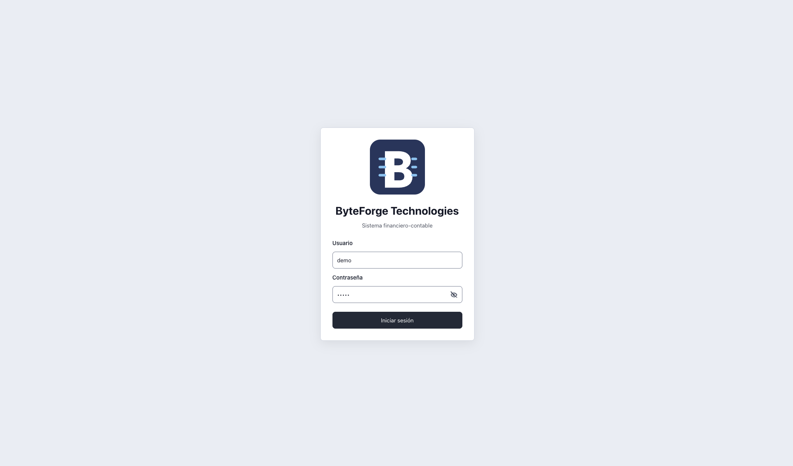
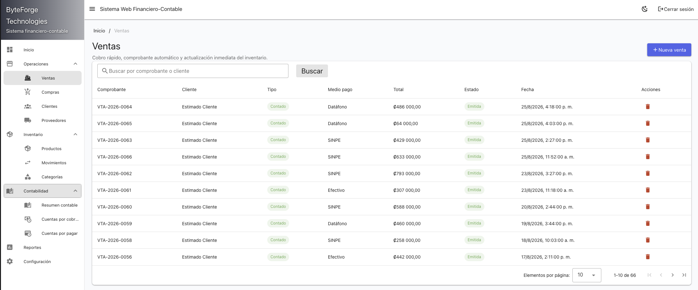
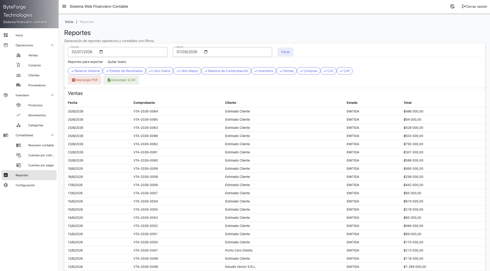
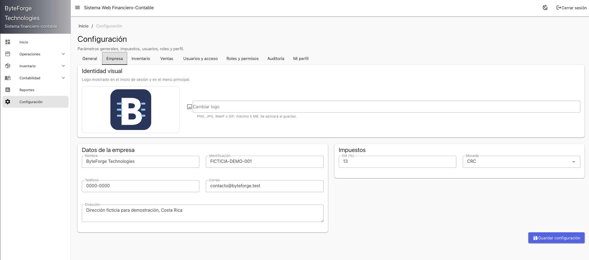
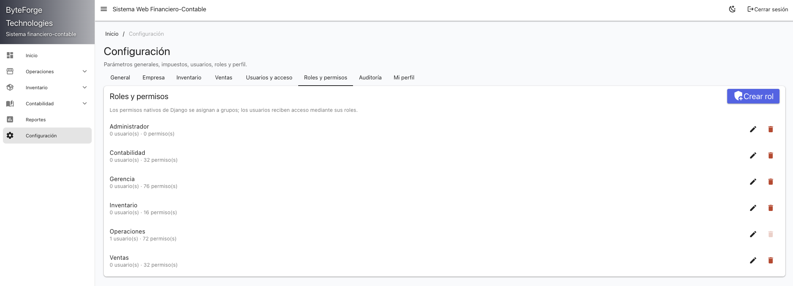
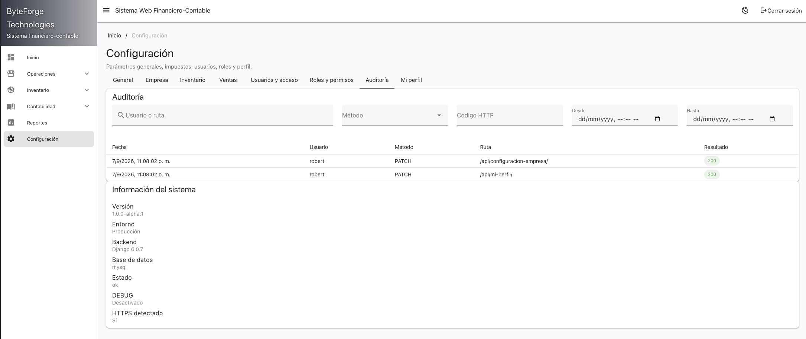
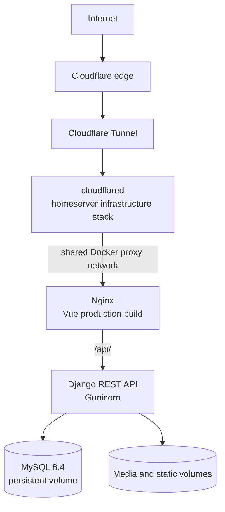

# Financial Accounting Web System (FAWS)

**Django · Vue · MySQL · Docker Compose · GitHub Actions · Cloudflare Tunnel**

[](https://github.com/robert-viquez/financial-accounting-web-system/actions/workflows/ci.yml)

A full-stack financial and accounting system that connects sales, purchases, inventory, receivables, payables, and double-entry accounting. FAWS is also a deployed systems project: its public portfolio demo runs as a containerized application behind Cloudflare Tunnel, with health checks, persistent storage, continuous integration, and deterministic data resets.

**[Open Live Demo](https://faws.robertviquez.com)** · **[Documentation](docs/)** · **[Architecture](#deployment-architecture)**

## Live Demo

**[https://faws.robertviquez.com](https://faws.robertviquez.com)**

The public environment contains an entirely fictional **ByteForge Technologies** dataset. Demo credentials are prefilled on the login screen and authenticate through the normal application flow. The `demo` user is a non-staff, non-superuser business account; Django Admin is separately protected and is not part of the public demo.

Demo business data is restored automatically every six hours. Do not enter personal, confidential, or production information.

## What FAWS does

- Manages customers, suppliers, products, categories, barcodes, and stock movements.
- Records cash and credit sales and purchases with inventory validation and reversal flows.
- Tracks accounts receivable, accounts payable, and their payments.
- Produces double-entry journal records, accounting periods, and financial reports.
- Exports selected operational and accounting reports to PDF and XLSX.
- Provides JWT authentication, native Django role-based access control, and an audit trail.
- Exposes an OpenAPI schema, Swagger UI, and a database-aware health endpoint.

## Product Tour

### Demo access and operational dashboard

<table>
  <tr>
    <td width="38%"></td>
    <td width="62%"></td>
  </tr>
  <tr>
    <td align="center"><sub>Public demo access uses prefilled credentials without bypassing authentication.</sub></td>
    <td align="center"><sub>Operational indicators combine sales, purchases, inventory, customers, and supplier activity.</sub></td>
  </tr>
</table>

### Inventory and sales

<table>
  <tr>
    <td width="50%"></td>
    <td width="50%"></td>
  </tr>
  <tr>
    <td align="center"><sub>Searchable product catalog with categories, current stock, pricing, and status.</sub></td>
    <td align="center"><sub>Sales ledger with payment method, state, timestamp, customer, and receipt references.</sub></td>
  </tr>
</table>

### Reporting and company configuration

<table>
  <tr>
    <td width="50%"></td>
    <td width="50%"></td>
  </tr>
  <tr>
    <td align="center"><sub>Date-filtered operational and accounting reports with PDF and XLSX export.</sub></td>
    <td align="center"><sub>Configurable company identity, branding, tax rate, and currency.</sub></td>
  </tr>
</table>

### Administration, RBAC, and auditability

<table>
  <tr>
    <td width="50%"></td>
    <td width="50%"></td>
  </tr>
  <tr>
    <td align="center"><sub>Business roles map native Django permissions to groups and users.</sub></td>
    <td align="center"><sub>Filtered request audit records and deployment-aware system status.</sub></td>
  </tr>
</table>

## Administration and security model

FAWS builds its business authorization model on Django primitives:

```text
User → Django Group → Django Permission
```

- Business administrators (`is_staff=True`) manage users, roles, business permissions, configuration, and audit records inside FAWS.
- Technical superusers are reserved for recovery and framework-level administration.
- Django Admin is a separate technical console restricted to active superusers.
- The public `demo` account remains `is_staff=False` and `is_superuser=False` and receives only its assigned business-role permissions.
- Audit middleware records authenticated API activity for review by business administrators.

Demo credentials are intentionally public and isolated from database, Django superuser, Cloudflare, and infrastructure credentials. Clean installations do not enable demo mode or create any user automatically.

## Deployment architecture



`cloudflared` is operated by a separate homeserver infrastructure stack; it is not a service in the FAWS Compose project. The tunnel reaches the Nginx frontend origin through a shared Docker proxy network. Nginx serves the compiled Vue application and proxies `/api/` to Gunicorn on the internal application network. MySQL and Django/Gunicorn are not publicly exposed, and the deployment requires no router port forwarding. Tunnel credentials and private network details are not stored in this repository.

For deployment configuration and operational limitations, see the [portfolio demo deployment guide](docs/deployment-demo.md).

## Technical highlights

| Area | Implementation |
| --- | --- |
| Application | Vue 3/Vite SPA and Django REST Framework API |
| Runtime | Nginx frontend, Gunicorn application server, MySQL 8.4 |
| Containers | Docker Compose, persistent volumes, dependency ordering, service health checks |
| Access control | Simple JWT plus native Django users, groups, and permissions |
| Operations | Environment-based configuration and deterministic, lock-protected demo reset |
| Delivery | GitHub Actions checks and image builds; deployment remains an operator-managed process |
| Public access | Cloudflare Tunnel from a separately managed infrastructure stack |

## Continuous integration

The [GitHub Actions workflow](.github/workflows/ci.yml) runs on pull requests and pushes to `main`:

- Django system checks and the backend test suite.
- Frontend Oxlint/ESLint checks and a Vite production build.
- Independent backend and frontend Docker image builds.

CI validates the application and container builds. Continuous deployment is not implemented in this repository.

## Deterministic demo reset

[`scripts/reset-demo.sh`](scripts/reset-demo.sh) restores the portfolio environment every six hours on the demo server. It:

- verifies that the database, backend, and frontend services are running;
- applies Django migrations before resetting data;
- rebuilds a deterministic, interconnected fictional dataset;
- restores the public `demo` user and business demo state;
- preserves technical superusers;
- verifies application health after the reset; and
- uses a lock to prevent overlapping reset jobs.

The reset is explicitly guarded by `ALLOW_DEMO_SEED=true` and is never enabled for a normal installation.

## Clean installation

A default Docker installation is intentionally separate from the public portfolio demo:

- no demo data or demo company identity is loaded;
- demo login prefill and demo seeding are disabled;
- no superuser—or any other user—is created automatically;
- application secrets and environment-specific configuration come from `.env`;
- MySQL and uploaded media persist in named Docker volumes.

Requirements: Docker Engine/Desktop with Docker Compose.

```bash
cp .env.example .env
# Replace every placeholder with local-only values.
docker compose up --build
```

Open `http://localhost:5173`, then create a technical administrator only if needed:

```bash
docker compose exec backend python manage.py createsuperuser
```

See [.env.example](.env.example) for available configuration and [docs/deployment-demo.md](docs/deployment-demo.md) for the explicitly enabled demo setup.

## Development and validation

Requirements: Python 3.13, Node.js 24 (or a compatible version declared in `frontend/package.json`), npm, and MySQL.

```bash
cp .env.example .env
python3 -m venv backend/.venv
source backend/.venv/bin/activate
pip install -r requirements.txt
python backend/manage.py migrate
python backend/manage.py runserver
```

In another terminal:

```bash
cd frontend
npm ci
npm run dev
```

Run the same core checks used by CI:

```bash
DJANGO_DEBUG=true DJANGO_USE_SQLITE_TESTS=true python backend/manage.py check
DJANGO_DEBUG=true DJANGO_USE_SQLITE_TESTS=true python backend/manage.py test
cd frontend
npm run lint:check
npm run build
```

## Repository map

```text
.
├── backend/              # Django project and business modules
├── frontend/             # Vue/Vite SPA and production Nginx config
├── docker/               # Container entrypoint
├── docs/                 # Deployment notes and product screenshots
├── scripts/              # Demo reset tooling
├── .github/workflows/    # Continuous integration
└── compose.yml           # FAWS application stack
```

With the application running, Swagger UI is available at `/api/docs/`, the OpenAPI schema at `/api/schema/`, and the database-aware health check at `/api/health/`.

## Project context

FAWS began as a university graduation project for a small-business accounting use case and continues as a portfolio project focused on full-stack engineering, systems administration, containerization, and cloud connectivity. ByteForge Technologies is only the fictional public-demo dataset; clean installations have no preset company identity.

## Author

Robert Viquez Santos<br>
[GitHub](https://github.com/robert-viquez) · [Portfolio](https://robertviquez.com)

## License

See [LICENSE](LICENSE).
