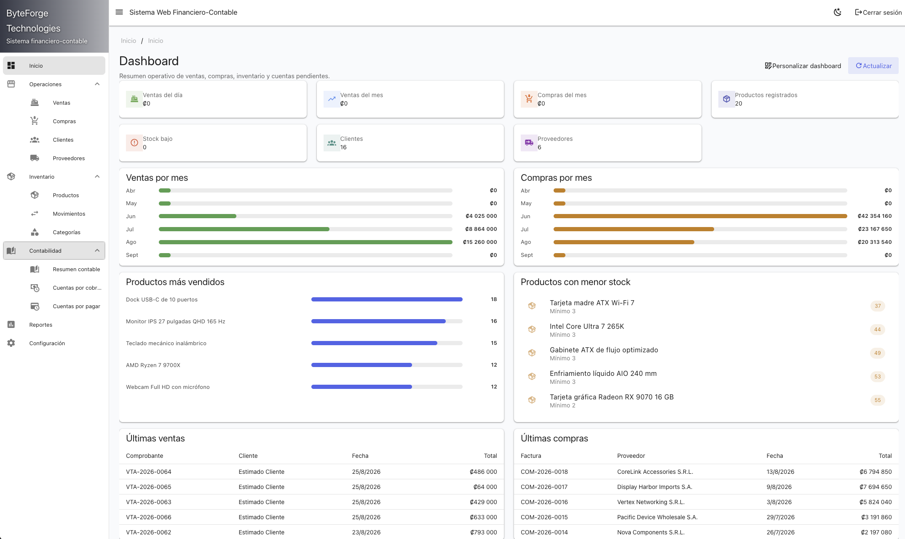
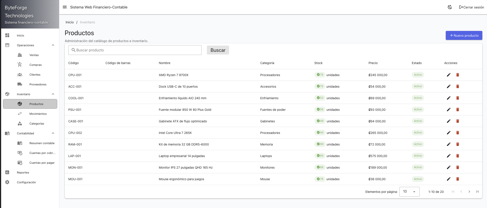

# Financial Accounting Web System

Financial Accounting Web System (FAWS) is a web application for managing sales, purchases, inventory, receivables, payables, and double-entry accounting.

## Quick start

Requirements: Docker Engine and Docker Compose.

```bash
git clone https://github.com/robert-viquez/financial-accounting-web-system.git
cd financial-accounting-web-system
docker compose up -d
```

Open <http://localhost:8080> and create the first administrator account. Application data and uploaded media are stored in the `faws_data` Docker volume.

## Features

- Customer, supplier, product, category, and inventory management
- Cash and credit sales and purchases
- Receivables, payables, payments, and reversal workflows
- Double-entry journals, accounting periods, and financial reports
- PDF and XLSX report exports
- JWT authentication, role-based permissions, audit records, and English/Spanish UI

## Screenshots

| Dashboard | Inventory |
| --- | --- |
| [](docs/screenshots/dashboard.png) | [](docs/screenshots/products.png) |

## Documentation

See the [documentation index](docs/index.md), [usage guide](docs/USAGE.md), [technical overview](docs/technical-overview.md), and [contribution guide](CONTRIBUTING.md).

Issues and pull requests are welcome.

## License

Licensed under the [MIT License](LICENSE).
