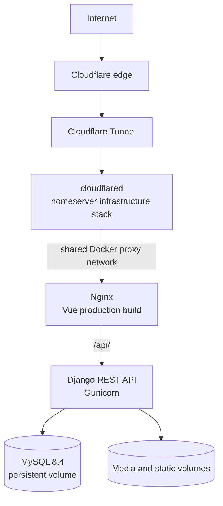

# Architecture and security

## Deployment architecture



The public topology is specific to the portfolio demo. A portable installation uses the default Compose network and does not require Cloudflare. See the [portfolio demo deployment guide](deployment-demo.md) for the external proxy network and tunnel boundary.

## Technical overview

| Area | Implementation |
| --- | --- |
| Application | Vue 3/Vite SPA and Django REST Framework API |
| Runtime | Nginx frontend, Gunicorn application server, MySQL 8.4 |
| Containers | Docker Compose, persistent volumes, dependency ordering, and service health checks |
| Access control | Simple JWT plus native Django users, groups, and permissions |
| Operations | Environment-based configuration and deterministic, lock-protected demo reset |
| Delivery | GitHub Actions validation followed by deployment from the `demo` branch |
| Public access | Cloudflare Tunnel in the portfolio environment |

## Authorization and auditability

FAWS builds its business authorization model on Django primitives:

```text
User → Django Group → Django Permission
```

- Business administrators (`is_staff=True`) manage users, roles, business permissions, configuration, and audit records inside FAWS.
- Technical superusers are reserved for recovery and framework-level administration.
- Django Admin is a separate technical console restricted to active superusers.
- The public `demo` account remains `is_staff=False` and `is_superuser=False` and receives only its assigned business-role permissions.
- Audit middleware records authenticated API activity for review by business administrators.

Demo credentials are intentionally public and isolated from database, Django superuser, Cloudflare, and infrastructure credentials. Clean installations do not enable demo mode or create users automatically.

## HTTP interfaces

With the application running:

- Swagger UI: `/api/docs/`
- OpenAPI schema: `/api/schema/`
- Database-aware health check: `/api/health/`

Return to the [documentation index](README.md).
